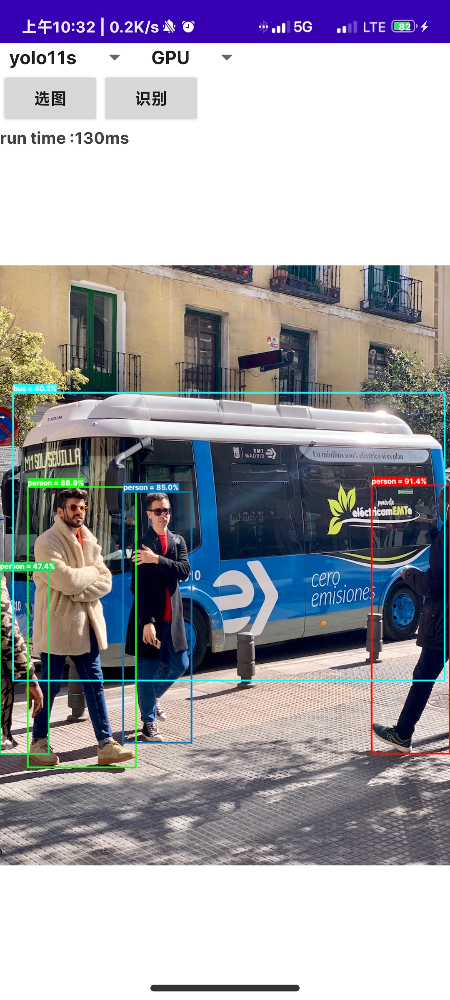

## ncnn-android-yolov8-obb
## 更新：
### 关于如何导出三个输出的模型 

查看issues置顶 https://github.com/PIPIKAI/android-ncnn-yolo11/issues/4

### 项目预览

## 参考

https://github.com/nihui/opencv-mobile

https://github.com/Tencent/ncnn

https://github.com/zhouweigogogo/yolo11-ncnn

https://github.com/PIPIKAI/ncnn-anroid-yolov8-obb

[速通一下YOLOv11的推理和ONNX转换](https://zhuanlan.zhihu.com/p/769076635)
